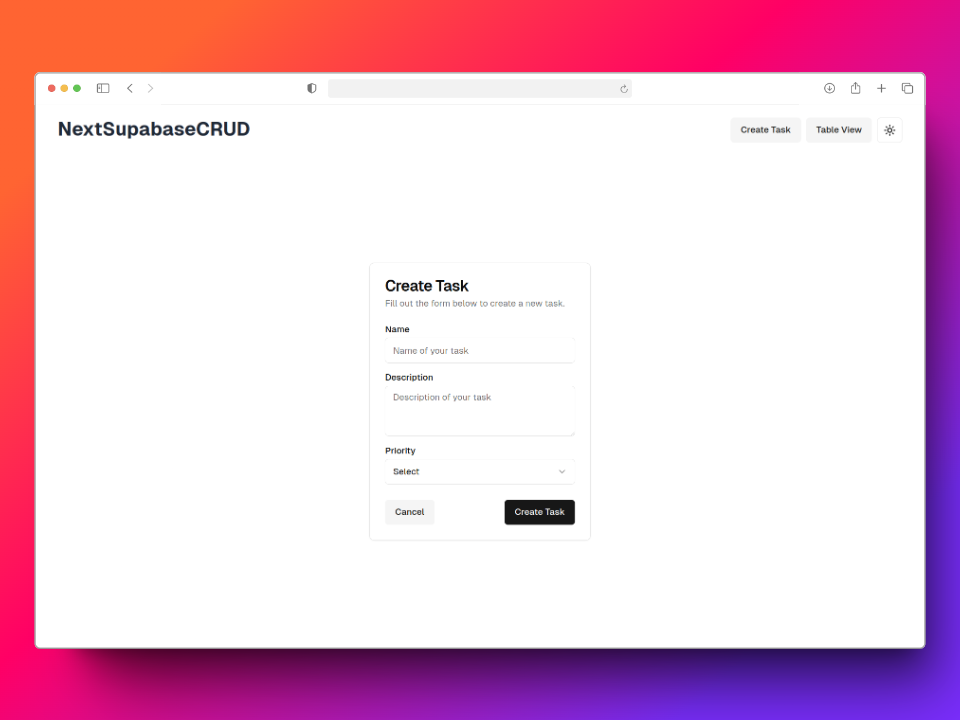

# Next.js To-Do List with Email Notification


## Tech Stack

- Frontend [Next.js](https://nextjs.org)
- [Supabase](https://supabase.com/) as Database
- Render tables with [Tanstack Table](https://tanstack.com/table/latest)
- Email notification with [Resend](https://resend.com/)
- Styling with [Tailwind CSS](https://tailwindcss.com)
- Components with [shadcn/ui](https://ui.shadcn.com/)

## Screenshots

Home Page and Dark Mode Activated


Create Task



Table View


Update Task and Dark Mode Activated


## Clone and run locally

1. You'll first need a Supabase project which can be made [via the Supabase dashboard](https://database.new)

2. Create a [Resend Account](https://resend.com/login)

3. Clone this repository

   ```bash
   git clone https://github.com/victoraranguren/nextjs-crud-supabase.git
   ```

4. Use `cd` to change into the app's directory

   ```bash
   cd nextjs-crud-supabase
   ```

5. Create `.env` and update the following:

   ```
   NEXT_PUBLIC_SUPABASE_URL=[INSERT SUPABASE PROJECT URL]
   NEXT_PUBLIC_SUPABASE_ANON_KEY=[INSERT SUPABASE PROJECT API ANON KEY]
   RESEND_API_KEY=[INSERT RESEND API KEY]
   RESEND_EMAIL_TEST=[INSERT RESEND EMAIL TEST]
   ```

   Both `NEXT_PUBLIC_SUPABASE_URL` and `NEXT_PUBLIC_SUPABASE_ANON_KEY` can be found in [your Supabase project's API settings](https://app.supabase.com/project/_/settings/api)

   `RESEND_API_KEY` can be found in [Resend API Keys](https://resend.com/api-keys)

   `RESEND_EMAIL_TEST` is usually the email with which you created the account

6. You can now install dependencies for the project with this command:

   ```bash
   npm i
   ```

7. You can now run the Next.js local development server:

   ```bash
   npm run dev
   ```

   The starter kit should now be running on [localhost:3000](http://localhost:3000/).
